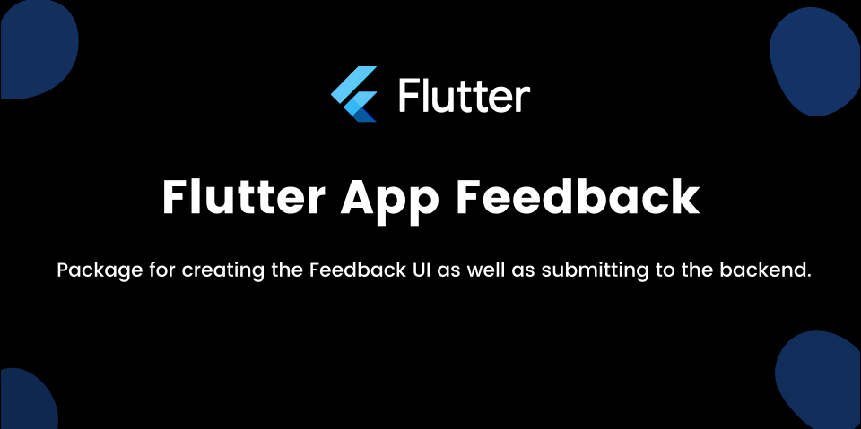

# Flutter App Feedback

Taking feedback from the user made easy!

Simply integrate ``` flutter_app_feedback ``` package into your Flutter project and you are ready to take feedbacks.

``` flutter_app_feedback ``` uses firebase as a default backend for taking the feedback.

Users feedbacks are stored in the [Cloud Firestore](https://firebase.google.com/docs/firestore) with the collection named ``` feedbacks ``` but you can also choose your own collection where you want to save the feedbacks.

This package also takes the screenshot of the current state of the app before taking to feedback UI. The screenshots are saved into the [Firebase Storage](https://firebase.google.com/docs/storage) by default with in the folder named ``` feedback_screenshots ```.

In order to use this package, you need to integrate the Firebase with your Flutter Project. The docs regarding this can be found over [Flutter Firebase](https://firebase.flutter.dev).